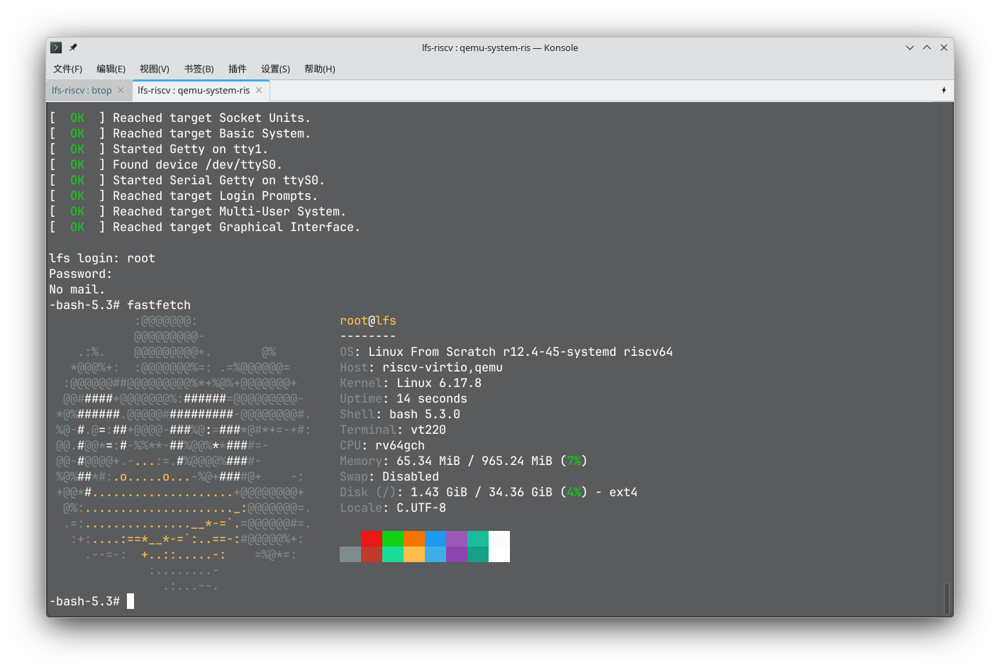

# purofle 的试炼记录

## 基本信息

- GitHub ID: purofle
- 联系邮箱: purofle@gmail.com
- rootfs 发布 Repo: https://github.com/purofle/riscv-lfs

## Rootfs 资产

- 文件名: rootfs-riscv64-lfs-purofle.tar.zst
- SHA256: 9223ad710f200a4a423e13b6f4e9ee1931db4f81e5047f95bfd8e53037083736

## 如何从 rootfs 运行起来

> 目标：从"下载 rootfs"到"进入环境并跑起 fastfetch"的最短步骤。

### 方式 1

1. 下载 rootfs 和 Image:
```bash
wget https://github.com/purofle/riscv-lfs/releases/download/r12.4-45-systemd/rootfs-riscv64-lfs-purofle.tar.zst
wget https://github.com/purofle/riscv-lfs/releases/download/r12.4-45-systemd/Image
```
2. 解压 rootfs 并创建虚拟硬盘:
```bash
tar -xvf rootfs-riscv64-lfs-purofle.tar.zst

qemu-img create lfs-riscv64.img 5G
mkfs.ext4 lfs-riscv64.img

sudo mount -o loop lfs-riscv64.img /mnt
sudo cp -r rootfs-riscv64-lfs-purofle/* /mnt
sudo umount /mnt
```

3. 启动 QEMU:
```bash
qemu-system-riscv64 \
  -machine virt \
  -m 1G \
  -bios default \
  -kernel Image \
  -append "root=/dev/vda rw" \ 
  -drive file=lfs-riscv64.img,format=raw,id=hd0,if=none \
  -device virtio-blk-device,drive=hd0 \
  -nographic
```

使用账号 `root` 以及密码 `114514` 登录，登录后直接运行 `fastfetch` 即可看到结果。

## fastfetch 证据



## 这是如何锻造的 (LFS 过程简述)

- 参考的教程/版本: [Linux From Scratch - Version r12.4-60-systemd](https://linuxfromscratch.org/lfs/view/systemd/) 以及 [Beyond Linux® From Scratch (systemd Edition)](https://linuxfromscratch.org/blfs/view/systemd)
- 关键配置（toolchain / glibc / 内核 / init / busybox / 包策略等）: 使用 systemd 258，gcc 15.2，glibc 2.42，自编译默认配置 6.17.8 版本内核。
- 与"原教旨 LFS"的偏离（如有）: 无

## 你踩过的坑

- 坑 1: 开始时预留的空间太小，不够编译 LFS，后来将虚拟硬盘扩展到了 30G 解决。
- 坑 2: 用的 Glibc 版本太新，[qemu-user 会出现问题](https://gitlab.com/qemu-project/qemu/-/issues/3065)，后来自行编译了带[补丁](https://github.com/qemu/qemu/compare/v10.1.2...dramforever:qemu:add-termios2)的 qemu 解决。
- 坑 3: curl 发送 https 请求时会报错，自行编译安装 [make-ca](https://www.linuxfromscratch.org/blfs/view/systemd/postlfs/make-ca.html) 解决。

## 已知问题 / TODO (如有)

- 开机时 systemd 会报错 `Failed to listen on User Login Management Varlink Socket`，但不影响使用。

## 许可与安全声明

- 我确认 rootfs 不包含任何密钥/Token/SSH Key/凭据/私人数据。